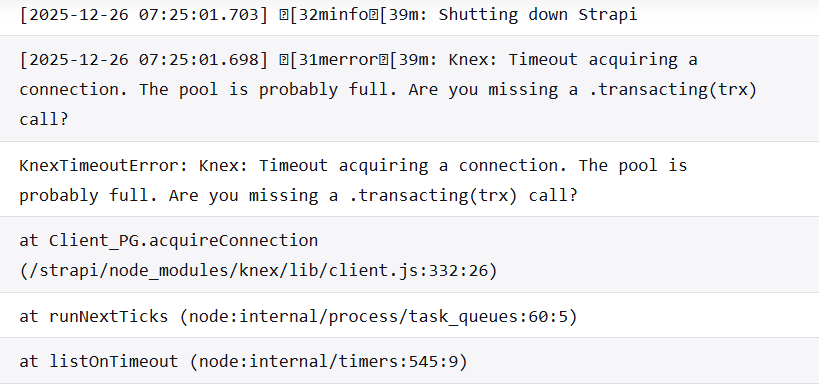
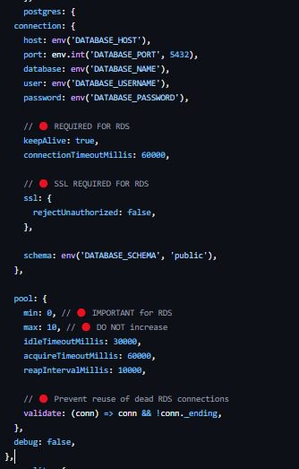

# Error-Knex-Timeout-acquiring-a-connection.-The-pool-is-probably-full
### Knex: Timeout acquiring a connection. The pool is probably full. Are you missing a .transacting(trx) call?

I faced this issue for over a week and tried multiple approaches to resolve it. Eventually, a small change fixed the problem—something I had overlooked earlier.

### Let me explain the structure of my project first :

Set up a GitHub Actions workflow to handle deployment:
 1. Push the pre-built Docker image to Amazon ECR, tagged with the GitHub commit SHA.
 2. Update the ECS Task Definition with the new image tag dynamically.
 3. Trigger an AWS CodeDeploy deployment to roll out the updated ECS service.
 4. Optionally, monitor deployment status and initiate rollback if the deployment fails.

### GitHub Push
### → GitHub Actions
###   → Docker Build
###     → Amazon ECR
###       → ECS Task Definition
###         → CodeDeploy
###           → ECS Fargate
###             → RDS PostgreSQL (Private Subnet)

### Even after fixing this file, the issue didn’t work. The problem was with the security groups. I searched Google and ChatGPT, and most results suggested changing the pool size or RDS connection. I tried those too, but the issue persisted. Below are my configuration file details.

config/database.ts 

### If you face the same issue as I did, even after correcting everything, try this step once.

### Workflows of this project

<pre>
Client (Browser)
  ↓
Application Load Balancer (Port 80)
  ↓
ALB Listener (Port 80)
  ↓
ALB Target Group (Port 1337)
  ↓
ECS Service (Fargate Tasks)
  ↓
Postgres RDS (Attach ECS security group)  IMPORTANT Here I made the mistake
  ↓
Container (Strapi on Port 1337)
</pre>

## Important

I created **four security groups** and configured them as follows:

1. **ALB Security Group**
   - Inbound rules: **80** and **443**
   - Listener configured on **port 80**

2. **Target Groups (Blue & Green)**
   - Application traffic routed to **port 1337**

3. **ECS Security Group**
   - Container runs on **port 1337**
   - **ALB security group is allowed as an inbound rule**

4. **RDS PostgreSQL Security Group**
   - Inbound rule on **port 5432**
   - **ECS security group is allowed as an inbound rule**

Previously, I had mistakenly attached the **ALB security group** to the **RDS inbound rule**. After realizing this and replacing it with the **ECS security group**, the issue was resolved and everything is working correctly now.

